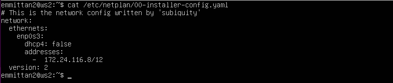
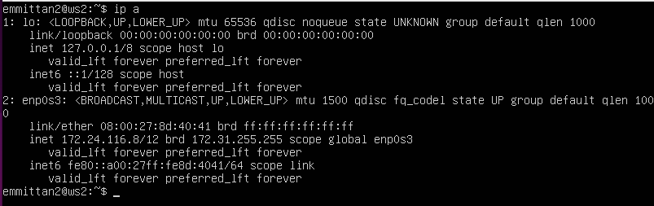
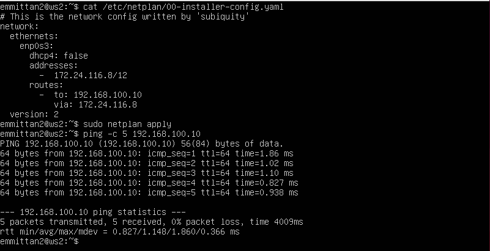
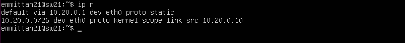
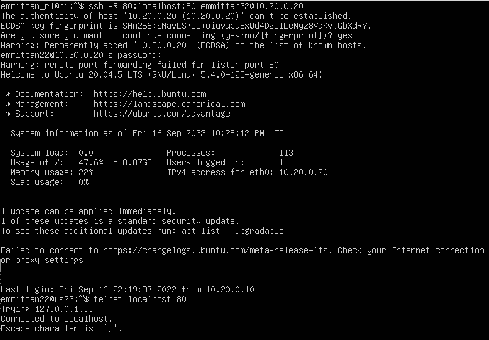

## Part 1. ipcalc tool

### 1.0 install ipcalc

### 1.1. Networks and Masks

#### 1.1.1) Network address of 192.167.38.54/13

#### 1.1.2.1) Conversion of the mask 255.255.255.0 to prefix and binary

#### 1.1.2.2) Conversion of the mask /15 to normal and binary

#### 1.1.2.3) Conversion of the mask 11111111.11111111.11111111.11110000 to normal and prefix

#### 1.1.3.1) Minimum and maximum host in 12.167.38.4 network with masks: /8

#### 1.1.3.2) Minimum and maximum host in 12.167.38.4 network with masks: 11111111.11111111.00000000.00000000

#### 1.1.3.3) Minimum and maximum host in 12.167.38.4 network with masks: 255.255.254.0

#### 1.1.3.4) Minimum and maximum host in 12.167.38.4 network with masks: /4

### 1.2. localhost

An application running on localhost can be accessed with the following IPs: 127.0.0.2 and 127.1.0.1  
An application running on localhost can not be accessed with the following IPs: 194.34.23.100 and 128.0.0.1

### 1.3. Network ranges and segments

#### 1.3.1) private and public IP addresses
    The Internet Assigned Numbers Authority (IANA) reserves the following IP address blocks for use as private IP addresses:
    10.0.0.0 to 10.255.255.255
    172.16.0.0 to 172.31.255.255
    192.168.0.0 to 192.168.255.255

    therefore:  
    10.0.0.45       private  
    134.43.0.2      public
    192.168.4.2     private
    172.20.250.4    private
    172.0.2.1       public
    192.172.0.1     public
    172.68.0.2      public
    172.16.255.255  private
    10.10.10.10     private
    192.169.168.1   public

#### 1.3.2) possible gateway IP addresses for 10.10.0.0/18 network

    therefore:  
    10.10.0.2
    10.10.10.10
    10.10.1.255

## Part 2. Static routing between two machines

### 2.0.1) View existing network interfaces with the ip a command
#### ws1

#### ws2

### 2.0.2) Set the addresses and masks

#### ws1

#### ws2
 

### 2.0.3) Run the netplan apply command to restart the network service
#### ws1
  

#### ws2
  
 

### 2.1. Adding a static route manually
#### ws1 adding static route and pinging it
  

#### ws2 adding static route and pinging it
  
 

### 2.2. Adding a static route with saving
#### reboot the system

#### adding static route in /etc/netplan/00-installer-config.yaml

#### ws1 applying changes and pinging ws2

#### ws2 applying changes and pinging ws1
 

## Part 3. iperf3 utility

### 3.1. Connection speed
- 8 Mpbs = 1 MB/s
- 100 MB/s = 800000 Kbps
- 1 Gbps = 1000 Mbps

### 3.2. iperf3 utility
#### ws1 open a server using iperf3 -s

#### ws2 connecting to the server on ws1 using iperf3 -c <host> -p <port> -R

## Part 4. Network firewall

### 4.1. iptables utility
#### ws1 writting a /etc/firewall.sh script

#### ws2 writting a /etc/firewall.sh script

#### running the script with bash

#### ws1 checking the results with iptables -S and pinging ws2
  

#### ws2 checking the results with iptables -S and pinging ws1
  

#### comparission:
- both stations allow tcp connection through port 22 and 80
- ws1 cannot ping but can be pingged
- ws2 can ping but cannot be pingged

### 4.2. nmap utility
#### ws1 pinging ws2 then cheching it with nmap

#### ws2 pinging ws1 then cheching it with namp

## Part 5. Static network routing

### 5.1 Configuration addresses
#### sw11
  

#### sw21
  

#### sw22
  

#### r1
  

#### r2
  

#### Ping ws22 from ws21

#### Ping r1 from ws11

### 5.2. Enabling IP forwarding
#### r1 using the command sysctl -w net.ipv4.ip_forward=1

#### r2 using the command sysctl -w net.ipv4.ip_forward=1

#### r1 through the /etc/sysctl.conf file

#### r2 through the /etc/sysctl.conf file

### 5.3. Default route configuration
#### ws11 Configure the default route (gateway) for the workstation
  

#### ws21 Configure the default route (gateway) for the workstation
  

#### ws22 Configure the default route (gateway) for the workstation
  

#### Ping r2 router from ws11

#### showing on r2 that the ping is reaching using tcpdump -tn -i eth1

### 5.4. Adding static routes
#### r1
  

#### r2
  

#### ws11
  
- for address 10.10.0.0/18 the route is set staticaly 
- for address 0.0.0.0/0 there is not specefic address (broadcat address), hen the request is referred to all next interfaces (one interface in our case)

### 5.5. Making a router list
#### Using traceroute utility to list routers in the path from ws11 to ws21

#### r1 running the tcpdump -tnv -i eth0 dump command
  
traceroute sends a series of data packets to the target node, while each time increasing by 1 the value of the  
 TTL ("lifetime") field. This field usually indicates the maximum number of routers that can be traversed by a packet.  
 The first packet is sent with a TTL equal to 1, and therefore the first router returns an ICMP message indicating   
 that data cannot be delivered. Traceroute records the address of the router, as well as the time between sending   
 a packet and receiving a response (this information is displayed on the computer monitor). Then traceroute repeats  
 sending the packet, but with a TTL equal to 2, which allows the first router to skip the packet further.  

### 5.6. Using ICMP protocol in routing
#### r1 capture the traffic going through eth0

#### ws11 Ping a non-existent IP

## Part 6. Dynamic IP configuration using DHCP

### 6.1 configure the DHCP service in the /etc/dhcp/dhcpd.conf file

#### r2

### 6.2 Write nameserver 8.8.8.8. in a resolv.conf file
#### r2

#### restart the isc-dhcp-server
  

#### ws21 reboot

#### ws21 ip a

#### ws21 pingging ws22

#### ws11 specify MAC address using etc/netplan/00-installer-config.yaml

#### r1
  

#### restart the isc-dhcp-server

#### ws21 ip a

### 6.3 Request ip address updates
#### ws21 before

#### dhclient

#### ws21 after

## Part 7. NAT

### 7.1 change etc/apache2/ports.conf file
#### ws22
  

#### r2
  

### 7.2 edit /etc/firewall.sh
#### r2 add and run the script

#### r1 pingging ws22

#### r2 allow routing of all ICMP protocol packets

#### r1 pingging ws22

#### r2 cat /etc/firewall.sh

#### r2 executing the script and cheching with -S

#### r1 check connection with sw22 with telnet

#### sw22 check the recieved connection with tcpdump

#### sw22 check connection with r1 with telnet

#### r1 check the received connection with tcpdump

## Part 8. Bonus. Introduction to SSH Tunnels

### 8.1 Start the Apapche web server on ws22 on localhost only
#### ws22 ports.conf file

#### ws22 apache2 service

### 8.2 Local TCP forwarding 
- `ssh -L local_port:remote_ip:remote_port user@hostname`
#### ws21 Use Local TCP forwarding from ws21 to ws22 to access the web server on ws22 from ws21

#### ws11 Use Remote TCP forwarding from ws11 to ws22 to access the web server on ws22 from ws11

